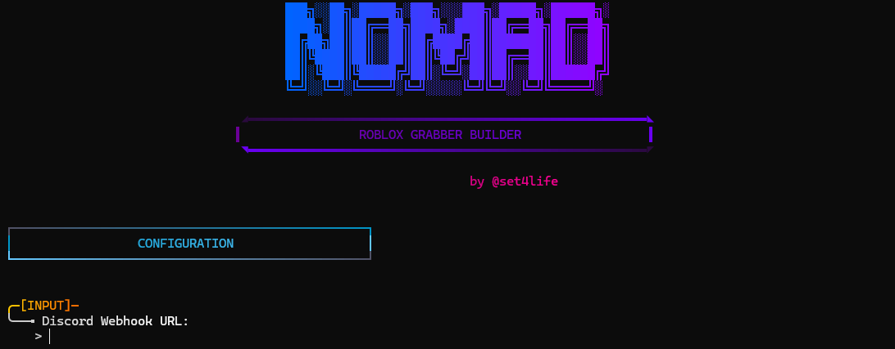
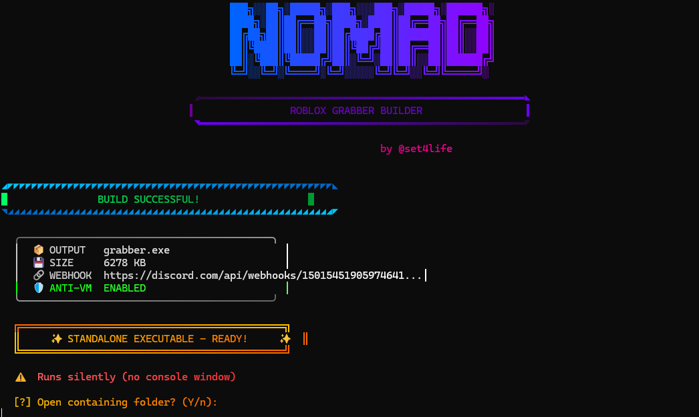
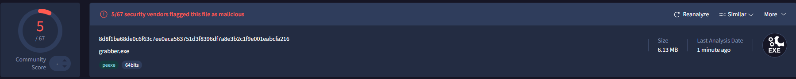
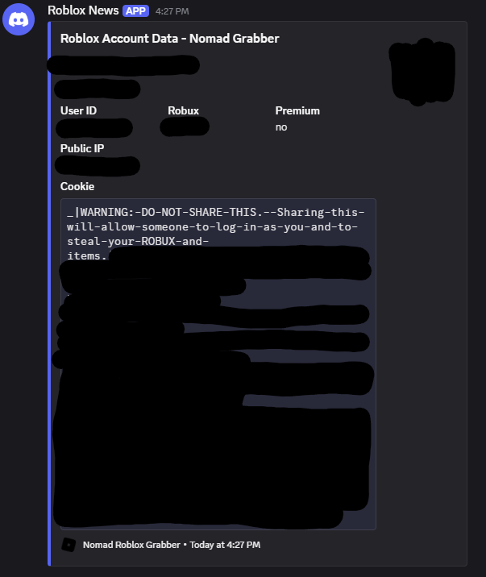

# 🚀 NOMAD Roblox Grabber

[](https://golang.org/)
[](https://python.org/)
[](https://github.com/lildev-afk)
[](https://t.me/morddev)

> **⚠️ Disclaimer:** This project is created solely for educational and research purposes. The author takes no responsibility for any misuse or illegal activities conducted with this software. Use at your own risk and ensure compliance with all applicable laws and regulations. 📚

## 📖 Description

NOMAD Roblox Grabber is an educational tool designed to demonstrate advanced concepts in software development, cybersecurity, and automation within the Roblox ecosystem. Built with Go and Python, this project showcases techniques like anti-VM detection, webhook integrations, and cryptographic operations.

Perfect for learning about:
- 🔒 Security bypass techniques
- 🌐 Webhook implementations
- 🛡️ Anti-analysis methods
- 🔧 Build automation

## ✨ Features

- 🛡️ **Anti-VM Detection**: Advanced virtual machine detection mechanisms
- 📡 **Discord Webhook Integration**: Seamless data transmission to Discord channels
- 👻 **Console Hiding**: Stealthy execution without visible console windows
- 🔐 **Cryptographic Operations**: Secure data handling and encryption
- 🏗️ **Python Builder**: Automated build process with beautiful CLI interface

## 📸 Screenshots

### 🛠️ Builder Interface


### 📦 Built Application


### 🔍 Detections


### 📊 Result


## 🚀 Installation

1. **Install Go** 🐹: Make sure you have Go 1.21+ installed
   ```bash
   # Download from https://golang.org/dl/
   ```

2. **Install Python** 🐍: Ensure Python 3.8+ is available
   ```bash
   # Download from https://python.org/downloads/
   ```

3. **Clone the Repository** 📥
   ```bash
   git clone https://github.com/lildev-afk/roblox-grabber.git
   cd roblox-grabber
   ```

4. **Run the Builder** ⚙️
   ```bash
   python builder.py
   ```

## 🎯 Usage

Simply run the generated batch file:

```bash
./run.bat
```

The application will execute with all configured features. 🎉

## 🤝 Contributing

This is an **educational project** only. Contributions are welcome for learning purposes! Feel free to:

- 📝 Submit issues for discussions
- 🔄 Fork and experiment
- 📚 Share your learnings

## 📜 License

This project is **for educational use only**. No formal license is provided.

---

> **⚠️ Final Disclaimer:** Again, this project is solely for educational and research purposes. The author assumes no liability for any misuse of this software. Stay ethical! 🛡️

---

## 📣 Sponsored By

[](https://t.me/morddev)

Join our Telegram channel for more educational content, updates, and discussions! 🚀

---

**Join our Telegram channel [@morddev](https://t.me/morddev) for more educational content and updates!**
